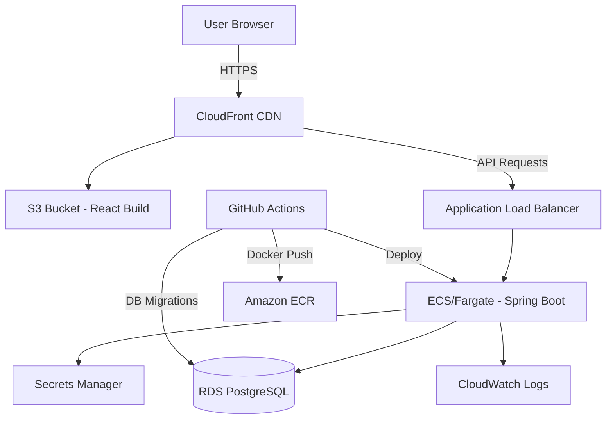

# Full Stack Analytics & Automation Platform - Architecture

## Project Overview

A production-style web-based operational analytics and automation platform that enables organizations to monitor performance, manage operational data, track workflows, and automate repetitive tasks through intelligent alerting and scheduling.

## Business Problem

Organizations with multiple operational teams (Receiving, Inventory, Picking, Packing, Shipping) struggle to:
- Monitor real-time operational performance across departments
- Identify productivity bottlenecks and error patterns
- Track workflow status and deadlines
- Automate detection of problems requiring attention
- Consolidate data from multiple sources into actionable insights

This platform provides a centralized solution for managers to view KPIs, analyze trends, and receive automated alerts when performance deviates from expected thresholds.

## Core Features

### 1. Authentication & Authorization
- JWT-based authentication with Spring Security
- Role-based access control (ADMIN, MANAGER, ANALYST)
- Secure password hashing with BCrypt
- Token expiration and refresh

### 2. Analytics Dashboard
- Real-time KPI cards (Total Records, Active Employees, Completed Tasks, Error Rate, etc.)
- Interactive charts (Productivity trends, Department comparison, Error patterns)
- Dynamic filtering by date range, department, employee, location
- Responsive layout with professional UI

### 3. Employee Management
- Complete CRUD operations for employee records
- Search, filtering, pagination, and sorting
- Department and role assignment
- Status tracking (Active, Inactive, On Leave)

### 4. Operational Records
- Daily operational data tracking (units processed, hours worked, errors)
- Automatic productivity rate calculation
- Data validation and error handling
- Historical performance tracking

### 5. Workflow Management
- Task creation and assignment
- Status tracking (NEW, IN_PROGRESS, BLOCKED, COMPLETED, CANCELLED)
- Priority levels (LOW, MEDIUM, HIGH, CRITICAL)
- Deadline monitoring and alerts

### 6. Automation Engine
- Scheduled batch processing of operational records
- Configurable threshold-based alerting:
  - Low productivity alerts
  - High error rate alerts
  - Workflow deadline alerts
- Automation run history and audit trail

### 7. Alert Management
- Real-time alert generation from automation rules
- Severity levels (INFO, WARNING, HIGH, CRITICAL)
- Alert filtering, search, and resolution
- Related record linking

### 8. Data Import/Export
- CSV bulk import with validation
- Import summary with success/failure counts
- Detailed error reporting for failed rows
- Filtered CSV export functionality

### 9. Analytics APIs
- Dedicated backend analytics endpoints
- Server-side aggregation and filtering
- Optimized SQL queries with proper indexing
- Trend analysis and top performer identification

## Technology Stack Justification

### Frontend: React + TypeScript
- **React**: Industry-standard component library with large ecosystem, excellent for building complex UIs with reusable components
- **TypeScript**: Type safety reduces runtime errors, improves developer experience, enables better IDE support and refactoring
- **React Router**: Declarative routing for SPA navigation
- **Recharts**: Lightweight charting library with good React integration
- **Axios**: Promise-based HTTP client with interceptors for error handling and auth

### Backend: Java + Spring Boot
- **Java**: Strongly-typed, enterprise-grade language with excellent tooling and performance
- **Spring Boot**: Rapid application development with auto-configuration, embedded server, and production-ready features
- **Spring Security**: Comprehensive security framework with JWT support
- **Spring Data JPA**: Simplifies database operations with repository pattern
- **Maven**: Dependency management and build tooling

### Database: PostgreSQL
- **PostgreSQL**: Open-source relational database with advanced features (JSONB, full-text search, excellent query optimizer)
- **ACID compliance**: Ensures data integrity for operational records
- **Indexing**: Powerful indexing options for query optimization
- **Scalability**: Handles large datasets efficiently

### DevOps: Docker + AWS
- **Docker**: Containerization ensures consistent environments across development, testing, and production
- **Docker Compose**: Local development orchestration
- **AWS ECS/Fargate**: Serverless container orchestration for scalable backend deployment
- **AWS RDS**: Managed PostgreSQL database with automated backups
- **AWS S3 + CloudFront**: Static frontend hosting with CDN
- **GitHub Actions**: CI/CD pipeline for automated testing and deployment

## System Architecture

### High-Level Architecture

```
┌─────────────────────────────────────────────────────────────────┐
│                         Client Browser                           │
│                    (React + TypeScript SPA)                      │
└────────────────────────────┬────────────────────────────────────┘
                             │ HTTPS
                             ▼
┌─────────────────────────────────────────────────────────────────┐
│                      AWS CloudFront CDN                          │
│                      (Static Frontend Assets)                    │
└────────────────────────────┬────────────────────────────────────┘
                             │ HTTPS
                             ▼
┌─────────────────────────────────────────────────────────────────┐
│                      AWS S3 Bucket                               │
│                   (React Build Artifacts)                        │
└─────────────────────────────────────────────────────────────────┘

┌─────────────────────────────────────────────────────────────────┐
│                    Spring Boot API Layer                         │
│                    (AWS ECS/Fargate)                             │
│  ┌──────────────────────────────────────────────────────────┐   │
│  │  Controllers (REST Endpoints)                           │   │
│  │  - EmployeeController                                     │   │
│  │  - OperationalRecordController                           │   │
│  │  - WorkflowController                                     │   │
│  │  - AlertController                                        │   │
│  │  - AnalyticsController                                    │   │
│  │  - AuthController                                         │   │
│  └──────────────────────────────────────────────────────────┘   │
│                              │                                   │
│  ▼                              ▼                               │
│  ┌──────────────────────────────────────────────────────────┐   │
│  │  Services (Business Logic)                               │   │
│  │  - EmployeeService                                        │   │
│  │  - OperationalRecordService                              │   │
│  │  - WorkflowService                                        │   │
│  │  - AlertService                                           │   │
│  │  - AnalyticsService                                       │   │
│  │  - AutomationService                                      │   │
│  │  - AuthService                                            │   │
│  └──────────────────────────────────────────────────────────┘   │
│                              │                                   │
│  ▼                              ▼                               │
│  ┌──────────────────────────────────────────────────────────┐   │
│  │  Repositories (Data Access)                              │   │
│  │  - EmployeeRepository                                     │   │
│  │  - OperationalRecordRepository                           │   │
│  │  - WorkflowRepository                                     │   │
│  │  - AlertRepository                                        │   │
│  │  - AutomationRunRepository                                │   │
│  │  - UserRepository                                         │   │
│  └──────────────────────────────────────────────────────────┘   │
│                              │                                   │
│                              ▼                                   │
│  ┌──────────────────────────────────────────────────────────┐   │
│  │  Spring Security (JWT Authentication)                     │   │
│  └──────────────────────────────────────────────────────────┘   │
└────────────────────────────┬────────────────────────────────────┘
                             │ JDBC
                             ▼
┌─────────────────────────────────────────────────────────────────┐
│                    AWS RDS PostgreSQL                            │
│  Tables: users, employees, operational_records,                 │
│          workflows, alerts, automation_runs                      │
└─────────────────────────────────────────────────────────────────┘

┌─────────────────────────────────────────────────────────────────┐
│                    Supporting Services                           │
│  - AWS CloudWatch (Logging & Monitoring)                        │
│  - AWS Secrets Manager (Credentials)                            │
│  - Amazon ECR (Docker Image Registry)                           │
└─────────────────────────────────────────────────────────────────┘
```

### Backend Layered Architecture

```
┌─────────────────────────────────────────────────────────────┐
│                    Presentation Layer                         │
│  (REST Controllers - @RestController)                        │
│  - Handle HTTP requests/responses                             │
│  - Request validation (@Valid)                                │
│  - Response DTO mapping                                       │
└────────────────────────────┬────────────────────────────────┘
                             │
                             ▼
┌─────────────────────────────────────────────────────────────┐
│                      Service Layer                            │
│  (@Service - Business Logic)                                  │
│  - Business rules and validation                             │
│  - Transaction management (@Transactional)                    │
│  - Entity-DTO mapping                                         │
│  - Orchestration of multiple repositories                     │
└────────────────────────────┬────────────────────────────────┘
                             │
                             ▼
┌─────────────────────────────────────────────────────────────┐
│                    Repository Layer                           │
│  (Spring Data JPA - @Repository)                              │
│  - Database CRUD operations                                   │
│  - Custom query methods (@Query)                              │
│  - Pagination and sorting support                             │
└────────────────────────────┬────────────────────────────────┘
                             │
                             ▼
┌─────────────────────────────────────────────────────────────┐
│                     Database Layer                            │
│  (PostgreSQL)                                                │
│  - Relational data storage                                    │
│  - Constraints and indexes                                   │
│  - ACID transactions                                         │
└─────────────────────────────────────────────────────────────┘

┌─────────────────────────────────────────────────────────────┐
│                   Cross-Cutting Concerns                     │
│  - Security (Spring Security + JWT)                          │
│  - Exception Handling (@RestControllerAdvice)                 │
│  - Logging (SLF4J + Logback)                                 │
│  - Validation (Jakarta Bean Validation)                       │
│  - Scheduling (@Scheduled)                                    │
│  - Configuration (@ConfigurationProperties)                   │
└─────────────────────────────────────────────────────────────┘
```

## Project Directory Structure

### Root Structure

```
windsurf-project-2/
├── backend/                          # Spring Boot Application
│   ├── src/
│   │   ├── main/
│   │   │   ├── java/
│   │   │   │   └── com/analytics/platform/
│   │   │   │       ├── AnalyticsPlatformApplication.java
│   │   │   │       ├── config/
│   │   │   │       │   ├── SecurityConfig.java
│   │   │   │       │   ├── JwtConfig.java
│   │   │   │       │   ├── DatabaseConfig.java
│   │   │   │       │   └── CorsConfig.java
│   │   │   │       ├── controller/
│   │   │   │       │   ├── AuthController.java
│   │   │   │       │   ├── EmployeeController.java
│   │   │   │       │   ├── OperationalRecordController.java
│   │   │   │       │   ├── WorkflowController.java
│   │   │   │       │   ├── AlertController.java
│   │   │   │       │   ├── AnalyticsController.java
│   │   │   │       │   └── ImportExportController.java
│   │   │   │       ├── service/
│   │   │   │       │   ├── AuthService.java
│   │   │   │       │   ├── EmployeeService.java
│   │   │   │       │   ├── OperationalRecordService.java
│   │   │   │       │   ├── WorkflowService.java
│   │   │   │       │   ├── AlertService.java
│   │   │   │       │   ├── AnalyticsService.java
│   │   │   │       │   ├── AutomationService.java
│   │   │   │       │   └── ImportExportService.java
│   │   │   │       ├── repository/
│   │   │   │       │   ├── UserRepository.java
│   │   │   │       │   ├── EmployeeRepository.java
│   │   │   │       │   ├── OperationalRecordRepository.java
│   │   │   │       │   ├── WorkflowRepository.java
│   │   │   │       │   ├── AlertRepository.java
│   │   │   │       │   └── AutomationRunRepository.java
│   │   │   │       ├── entity/
│   │   │   │       │   ├── User.java
│   │   │   │       │   ├── Employee.java
│   │   │   │       │   ├── OperationalRecord.java
│   │   │   │       │   ├── Workflow.java
│   │   │   │       │   ├── Alert.java
│   │   │   │       │   └── AutomationRun.java
│   │   │   │       ├── dto/
│   │   │   │       │   ├── request/
│   │   │   │       │   │   ├── LoginRequest.java
│   │   │   │       │   │   ├── EmployeeRequest.java
│   │   │   │       │   │   ├── OperationalRecordRequest.java
│   │   │   │       │   │   ├── WorkflowRequest.java
│   │   │   │       │   │   └── WorkflowStatusUpdateRequest.java
│   │   │   │       │   └── response/
│   │   │   │       │       ├── LoginResponse.java
│   │   │   │       │       ├── EmployeeResponse.java
│   │   │   │       │       ├── OperationalRecordResponse.java
│   │   │   │       │       ├── WorkflowResponse.java
│   │   │   │       │       ├── AlertResponse.java
│   │   │   │       │       ├── DashboardSummaryResponse.java
│   │   │   │       │       ├── AnalyticsResponse.java
│   │   │   │       │       └── ImportSummaryResponse.java
│   │   │   │       ├── exception/
│   │   │   │       │   ├── ResourceNotFoundException.java
│   │   │   │       │   ├── ValidationException.java
│   │   │   │       │   ├── DuplicateResourceException.java
│   │   │   │       │   └── GlobalExceptionHandler.java
│   │   │   │       ├── security/
│   │   │   │       │   ├── JwtAuthenticationFilter.java
│   │   │   │       │   ├── JwtTokenProvider.java
│   │   │   │       │   └── UserDetailsServiceImpl.java
│   │   │   │       ├── scheduler/
│   │   │   │       │   └── AutomationScheduler.java
│   │   │   │       ├── mapper/
│   │   │   │       │   ├── EmployeeMapper.java
│   │   │   │       │   ├── OperationalRecordMapper.java
│   │   │   │       │   └── WorkflowMapper.java
│   │   │   │       └── util/
│   │   │   │           └── CsvParser.java
│   │   │   └── resources/
│   │   │       ├── application.yml
│   │   │       ├── application-dev.yml
│   │   │       ├── application-prod.yml
│   │   │       └── data.sql
│   │   └── test/
│   │       └── java/
│   │           └── com/analytics/platform/
│   │               ├── service/
│   │               │   ├── EmployeeServiceTest.java
│   │               │   ├── OperationalRecordServiceTest.java
│   │               │   ├── AnalyticsServiceTest.java
│   │               │   └── AutomationServiceTest.java
│   │               ├── controller/
│   │               │   ├── EmployeeControllerTest.java
│   │               │   └── AnalyticsControllerTest.java
│   │               └── repository/
│   │                   └── EmployeeRepositoryTest.java
│   ├── Dockerfile
│   └── pom.xml
│
├── frontend/                         # React TypeScript Application
│   ├── public/
│   │   ├── index.html
│   │   └── favicon.ico
│   ├── src/
│   │   ├── components/
│   │   │   ├── common/
│   │   │   │   ├── Navbar.tsx
│   │   │   │   ├── Sidebar.tsx
│   │   │   │   ├── LoadingSpinner.tsx
│   │   │   │   ├── ErrorMessage.tsx
│   │   │   │   ├── Modal.tsx
│   │   │   │   ├── ConfirmationDialog.tsx
│   │   │   │   └── Pagination.tsx
│   │   │   ├── dashboard/
│   │   │   │   ├── DashboardCard.tsx
│   │   │   │   ├── ChartCard.tsx
│   │   │   │   └── FilterPanel.tsx
│   │   │   ├── employees/
│   │   │   │   ├── EmployeeForm.tsx
│   │   │   │   └── EmployeeTable.tsx
│   │   │   ├── records/
│   │   │   │   ├── RecordForm.tsx
│   │   │   │   └── RecordTable.tsx
│   │   │   ├── workflows/
│   │   │   │   ├── WorkflowForm.tsx
│   │   │   │   └── WorkflowTable.tsx
│   │   │   └── alerts/
│   │   │       └── AlertTable.tsx
│   │   ├── pages/
│   │   │   ├── LoginPage.tsx
│   │   │   ├── DashboardPage.tsx
│   │   │   ├── EmployeesPage.tsx
│   │   │   ├── OperationalRecordsPage.tsx
│   │   │   ├── WorkflowsPage.tsx
│   │   │   ├── AlertsPage.tsx
│   │   │   ├── AutomationHistoryPage.tsx
│   │   │   ├── ImportDataPage.tsx
│   │   │   ├── AnalyticsPage.tsx
│   │   │   └── SettingsPage.tsx
│   │   ├── services/
│   │   │   ├── apiClient.ts
│   │   │   ├── authService.ts
│   │   │   ├── employeeService.ts
│   │   │   ├── recordService.ts
│   │   │   ├── workflowService.ts
│   │   │   ├── alertService.ts
│   │   │   ├── analyticsService.ts
│   │   │   └── automationService.ts
│   │   ├── hooks/
│   │   │   ├── useAuth.ts
│   │   │   ├── useEmployees.ts
│   │   │   └── useAnalytics.ts
│   │   ├── types/
│   │   │   ├── employee.types.ts
│   │   │   ├── record.types.ts
│   │   │   ├── workflow.types.ts
│   │   │   ├── alert.types.ts
│   │   │   └── analytics.types.ts
│   │   ├── utils/
│   │   │   ├── formatters.ts
│   │   │   ├── validators.ts
│   │   │   └── constants.ts
│   │   ├── context/
│   │   │   └── AuthContext.tsx
│   │   ├── routes/
│   │   │   └── AppRoutes.tsx
│   │   ├── App.tsx
│   │   ├── main.tsx
│   │   └── index.css
│   ├── Dockerfile
│   ├── package.json
│   ├── tsconfig.json
│   └── vite.config.ts
│
├── .github/
│   └── workflows/
│       └── ci-cd-pipeline.yml
│
├── docker-compose.yml
├── .gitignore
├── README.md
├── INTERVIEW_GUIDE.md
├── API_DOCUMENTATION.md
├── DATABASE_DESIGN.md
├── DEPLOYMENT.md
└── ARCHITECTURE.md
```

## Database Design

### Entity Relationships

```mermaid
erDiagram
    User ||--o{ Employee : "manages"
    Employee ||--o{ OperationalRecord : "has"
    Employee ||--o{ Workflow : "assigned_to"
    Department ||--o{ Employee : "contains"
    Department ||--o{ OperationalRecord : "categorizes"
    OperationalRecord ||--o{ Alert : "triggers"
    Workflow ||--o{ Alert : "triggers"
    AutomationRun ||--o{ Alert : "generates"
    
    User {
        uuid id PK
        string username UK
        string password
        string email
        Role role
        boolean enabled
        LocalDateTime createdAt
    }
    
    Employee {
        uuid id PK
        string employeeId UK
        string firstName
        string lastName
        string email
        Department department
        string role
        string location
        string shift
        EmployeeStatus status
        LocalDateTime createdAt
        LocalDateTime updatedAt
    }
    
    OperationalRecord {
        uuid id PK
        uuid employeeId FK
        Department department
        ProcessType processType
        int unitsProcessed
        decimal hoursWorked
        decimal productivityRate
        int errors
        RecordStatus status
        string location
        LocalDate workDate
        LocalDateTime createdAt
        LocalDateTime updatedAt
    }
    
    Workflow {
        uuid id PK
        string title
        text description
        Department department
        Priority priority
        uuid assignedUserId FK
        WorkflowStatus status
        LocalDate dueDate
        LocalDateTime createdAt
        LocalDateTime completedAt
    }
    
    Alert {
        uuid id PK
        AlertType type
        Severity severity
        string message
        uuid employeeId FK
        Department department
        uuid relatedRecordId FK
        string relatedRecordType
        boolean resolved
        LocalDateTime resolvedAt
        LocalDateTime createdAt
    }
    
    AutomationRun {
        uuid id PK
        AutomationType automationType
        LocalDateTime startTime
        LocalDateTime endTime
        int recordsProcessed
        int alertsCreated
        AutomationStatus status
        text errorMessage
    }
    
    enum Role {
        ADMIN
        MANAGER
        ANALYST
    }
    
    enum Department {
        RECEIVING
        INVENTORY
        PICKING
        PACKING
        SHIPPING
    }
    
    enum ProcessType {
        RECEIVING
        STOCKING
        PICKING
        PACKING
        SHIPPING
    }
    
    enum EmployeeStatus {
        ACTIVE
        INACTIVE
        ON_LEAVE
    }
    
    enum RecordStatus {
        VALID
        FLAGGED
        UNDER_REVIEW
    }
    
    enum Priority {
        LOW
        MEDIUM
        HIGH
        CRITICAL
    }
    
    enum WorkflowStatus {
        NEW
        IN_PROGRESS
        BLOCKED
        COMPLETED
        CANCELLED
    }
    
    enum AlertType {
        LOW_PRODUCTIVITY
        HIGH_ERROR_RATE
        DEADLINE_APPROACHING
        WORKFLOW_OVERDUE
        DATA_ANOMALY
    }
    
    enum Severity {
        INFO
        WARNING
        HIGH
        CRITICAL
    }
    
    enum AutomationType {
        PRODUCTIVITY_CHECK
        ERROR_RATE_CHECK
        DEADLINE_CHECK
        BATCH_PROCESSING
    }
    
    enum AutomationStatus {
        RUNNING
        COMPLETED
        FAILED
    }
```

### Table Descriptions

#### users
Stores authentication and authorization information. Each user can manage multiple employees.

**Relationships:**
- One-to-many with Employee (admin/manager can manage multiple employees)

**Indexes:**
- PRIMARY KEY on id
- UNIQUE INDEX on username
- INDEX on email

#### employees
Stores employee information including department, role, location, and shift.

**Relationships:**
- Many-to-one with User (managed by)
- One-to-many with OperationalRecord (has multiple records)
- One-to-many with Workflow (assigned multiple workflows)

**Indexes:**
- PRIMARY KEY on id
- UNIQUE INDEX on employeeId
- INDEX on department
- INDEX on status
- INDEX on location
- COMPOSITE INDEX on (department, status)

#### operational_records
Stores daily operational performance data for each employee.

**Relationships:**
- Many-to-one with Employee (belongs to)
- One-to-many with Alert (can trigger alerts)

**Indexes:**
- PRIMARY KEY on id
- INDEX on employeeId (Foreign Key)
- INDEX on workDate
- INDEX on department
- INDEX on status
- COMPOSITE INDEX on (employeeId, workDate)
- COMPOSITE INDEX on (department, workDate)
- INDEX on createdAt

#### workflows
Stores workflow/task information with assignment and status tracking.

**Relationships:**
- Many-to-one with User (assigned to)
- Many-to-one with Department
- One-to-many with Alert (can trigger deadline alerts)

**Indexes:**
- PRIMARY KEY on id
- INDEX on assignedUserId (Foreign Key)
- INDEX on department
- INDEX on status
- INDEX on dueDate
- INDEX on priority
- COMPOSITE INDEX on (status, dueDate)

#### alerts
Stores alerts generated by automation rules or manual creation.

**Relationships:**
- Many-to-one with Employee (related to)
- Many-to-one with OperationalRecord (can reference)
- Many-to-one with Workflow (can reference)
- Many-to-one with AutomationRun (generated by)

**Indexes:**
- PRIMARY KEY on id
- INDEX on employeeId
- INDEX on type
- INDEX on severity
- INDEX on resolved
- INDEX on department
- INDEX on createdAt
- COMPOSITE INDEX on (resolved, createdAt)

#### automation_runs
Stores execution history of automation jobs for audit and monitoring.

**Relationships:**
- One-to-many with Alert (generates alerts)

**Indexes:**
- PRIMARY KEY on id
- INDEX on automationType
- INDEX on startTime
- INDEX on status
- COMPOSITE INDEX on (automationType, startTime)

## REST API Design

### Authentication Endpoints

```
POST /api/auth/login
Request: { username, password }
Response: { token, type, user: { id, username, email, role } }
Status: 200 OK, 401 Unauthorized

POST /api/auth/register (Optional - for initial setup)
Request: { username, password, email, role }
Response: { id, username, email, role }
Status: 201 Created, 400 Bad Request, 409 Conflict
```

### Employee Endpoints

```
POST /api/employees
Request: EmployeeRequest
Response: EmployeeResponse
Status: 201 Created, 400 Bad Request, 409 Conflict

GET /api/employees
Query: page, size, sort, department, status, location, search
Response: Page<EmployeeResponse>
Status: 200 OK

GET /api/employees/{id}
Response: EmployeeResponse
Status: 200 OK, 404 Not Found

PUT /api/employees/{id}
Request: EmployeeRequest
Response: EmployeeResponse
Status: 200 OK, 400 Bad Request, 404 Not Found

DELETE /api/employees/{id}
Status: 204 No Content, 404 Not Found, 409 Conflict (has records)

GET /api/employees/{id}/records
Query: page, size, startDate, endDate
Response: Page<OperationalRecordResponse>
Status: 200 OK
```

### Operational Record Endpoints

```
POST /api/records
Request: OperationalRecordRequest
Response: OperationalRecordResponse
Status: 201 Created, 400 Bad Request

GET /api/records
Query: page, size, sort, department, employeeId, startDate, endDate, status, location
Response: Page<OperationalRecordResponse>
Status: 200 OK

GET /api/records/{id}
Response: OperationalRecordResponse
Status: 200 OK, 404 Not Found

PUT /api/records/{id}
Request: OperationalRecordRequest
Response: OperationalRecordResponse
Status: 200 OK, 400 Bad Request, 404 Not Found

DELETE /api/records/{id}
Status: 204 No Content, 404 Not Found
```

### Workflow Endpoints

```
POST /api/workflows
Request: WorkflowRequest
Response: WorkflowResponse
Status: 201 Created, 400 Bad Request

GET /api/workflows
Query: page, size, sort, department, status, priority, assignedUserId, dueDateBefore, dueDateAfter
Response: Page<WorkflowResponse>
Status: 200 OK

GET /api/workflows/{id}
Response: WorkflowResponse
Status: 200 OK, 404 Not Found

PUT /api/workflows/{id}
Request: WorkflowRequest
Response: WorkflowResponse
Status: 200 OK, 400 Bad Request, 404 Not Found

PATCH /api/workflows/{id}/status
Request: WorkflowStatusUpdateRequest
Response: WorkflowResponse
Status: 200 OK, 400 Bad Request, 404 Not Found

DELETE /api/workflows/{id}
Status: 204 No Content, 404 Not Found
```

### Alert Endpoints

```
GET /api/alerts
Query: page, size, sort, type, severity, department, employeeId, resolved, startDate, endDate
Response: Page<AlertResponse>
Status: 200 OK

GET /api/alerts/{id}
Response: AlertResponse
Status: 200 OK, 404 Not Found

PATCH /api/alerts/{id}/resolve
Status: 200 OK, 404 Not Found

PATCH /api/alerts/bulk-resolve
Request: { alertIds: [] }
Response: { resolvedCount }
Status: 200 OK
```

### Analytics Endpoints

```
GET /api/analytics/summary
Query: startDate, endDate, department, location
Response: DashboardSummaryResponse
Status: 200 OK

GET /api/analytics/productivity
Query: startDate, endDate, department, employeeId, groupBy (day, week, month, department, employee)
Response: AnalyticsResponse
Status: 200 OK

GET /api/analytics/departments
Query: startDate, endDate
Response: AnalyticsResponse
Status: 200 OK

GET /api/analytics/errors
Query: startDate, endDate, department
Response: AnalyticsResponse
Status: 200 OK

GET /api/analytics/trends
Query: startDate, endDate, department, metric (productivity, errors, tasks)
Response: AnalyticsResponse
Status: 200 OK

GET /api/analytics/top-performers
Query: startDate, endDate, department, limit
Response: AnalyticsResponse
Status: 200 OK

GET /api/analytics/workflows
Query: startDate, endDate, department, status
Response: AnalyticsResponse
Status: 200 OK

GET /api/analytics/automation
Query: startDate, endDate, automationType
Response: AnalyticsResponse
Status: 200 OK
```

### Import/Export Endpoints

```
POST /api/import/operational-records
Request: multipart/form-data with CSV file
Response: ImportSummaryResponse
Status: 200 OK, 400 Bad Request

GET /api/export/operational-records
Query: startDate, endDate, department, employeeId, status
Response: CSV file
Status: 200 OK

GET /api/export/employees
Query: department, status, location
Response: CSV file
Status: 200 OK
```

### Automation Endpoints

```
GET /api/automation/history
Query: page, size, sort, automationType, status, startDate, endDate
Response: Page<AutomationRunResponse>
Status: 200 OK

POST /api/automation/trigger
Request: { automationType }
Response: AutomationRunResponse
Status: 200 OK, 400 Bad Request
```

## Frontend Page Design

### Page Structure

```
1. LoginPage
   - Username/password form
   - JWT token storage
   - Redirect to dashboard on success
   - Error handling for invalid credentials

2. DashboardPage
   - KPI cards row (8 cards)
   - Charts row (2-3 charts)
   - Recent alerts table
   - Filter panel (date range, department, location)
   - Responsive grid layout

3. EmployeesPage
   - Data table with pagination
   - Search and filter sidebar
   - Add employee modal
   - Edit employee modal
   - Delete confirmation dialog
   - Export button

4. OperationalRecordsPage
   - Data table with pagination
   - Advanced filters (date range, department, employee, status)
   - Add record form
   - Edit record form
   - Productivity calculation display
   - Import CSV button
   - Export filtered data button

5. WorkflowsPage
   - Kanban-style or table view
   - Filter by status, priority, department
   - Create workflow modal
   - Edit workflow modal
   - Status update buttons
   - Due date highlighting

6. AlertsPage
   - Alert table with severity color coding
   - Filters by type, severity, department, resolved status
   - Bulk resolve action
   - Individual resolve action
   - Alert details modal

7. AutomationHistoryPage
   - Automation run history table
   - Filter by automation type, status, date range
   - Run details modal
   - Manual trigger button (for authorized users)

8. ImportDataPage
   - CSV file upload area
   - Template download
   - Import progress indicator
   - Validation results display
   - Failed rows table with error details

9. AnalyticsPage
   - Advanced analytics dashboard
   - Multiple chart types (line, bar, pie)
   - Dimension selector (time, department, employee)
   - Metric selector
   - Date range picker
   - Export report button

10. SettingsPage
    - User profile information
    - Change password form
    - Application settings (if applicable)
    - Theme toggle (optional)
```

### Component Hierarchy

```
App
├── AuthProvider
├── Router
│   ├── LoginPage
│   └── MainLayout
│       ├── Navbar
│       ├── Sidebar
│       └── Content Area
│           ├── DashboardPage
│           │   ├── DashboardCard (x8)
│           │   ├── ChartCard (x3)
│           │   ├── FilterPanel
│           │   └── RecentAlertsTable
│           ├── EmployeesPage
│           │   ├── EmployeeTable
│           │   ├── FilterPanel
│           │   ├── EmployeeForm (Modal)
│           │   └── ConfirmationDialog
│           ├── OperationalRecordsPage
│           │   ├── RecordTable
│           │   ├── FilterPanel
│           │   ├── RecordForm (Modal)
│           │   └── ImportButton
│           ├── WorkflowsPage
│           │   ├── WorkflowTable
│           │   ├── FilterPanel
│           │   └── WorkflowForm (Modal)
│           ├── AlertsPage
│           │   ├── AlertTable
│           │   ├── FilterPanel
│           │   └── AlertDetails (Modal)
│           ├── AutomationHistoryPage
│           │   ├── AutomationRunTable
│           │   └── RunDetails (Modal)
│           ├── ImportDataPage
│           │   ├── FileUploadArea
│           │   ├── ImportProgress
│           │   └── ValidationResults
│           ├── AnalyticsPage
│           │   ├── ChartContainer
│           │   ├── DimensionSelector
│           │   └── MetricSelector
│           └── SettingsPage
│               └── SettingsForm
└── Global Components
    ├── LoadingSpinner
    ├── ErrorMessage
    └── Modal
```

## AWS Architecture

### Production Architecture



### AWS Components

#### Frontend Deployment
- **S3**: Stores React build artifacts (static files)
- **CloudFront**: CDN for global content delivery, SSL termination, caching
- **Route 53**: DNS management (optional - can use domain registrar)

#### Backend Deployment
- **ECS/Fargate**: Serverless container orchestration for Spring Boot API
- **Application Load Balancer**: Traffic distribution, health checks, SSL
- **ECR**: Docker image registry for storing container images

#### Database
- **RDS PostgreSQL**: Managed relational database with automated backups, Multi-AZ for production

#### Security & Secrets
- **Secrets Manager**: Stores database credentials, JWT secrets, API keys
- **IAM**: Role-based access control for AWS resources
- **Security Groups**: Network-level firewall rules

#### Monitoring & Logging
- **CloudWatch Logs**: Centralized log aggregation from ECS
- **CloudWatch Metrics**: CPU, memory, and custom application metrics
- **X-Ray** (optional): Distributed tracing for API performance

#### CI/CD
- **GitHub Actions**: Build, test, and deploy pipeline
- **CodeBuild** (alternative): AWS-native build service

### Lower-Cost Alternative (Portfolio-Friendly)

For a portfolio project without incurring AWS charges:

1. **Frontend**: Deploy to Vercel, Netlify, or GitHub Pages (free tiers)
2. **Backend**: Deploy to Railway, Render, or Heroku (free/low-cost tiers)
3. **Database**: Use managed PostgreSQL from the same platform (Railway/Render)
4. **CI/CD**: GitHub Actions (free for public repositories)

This approach demonstrates the same architectural patterns while keeping costs minimal.

## Development Roadmap

### Phase 1: Architecture and Design ✓
- Requirements analysis
- System architecture design
- Database schema design
- API endpoint design
- Frontend page design
- AWS architecture planning
- Project structure definition

### Phase 2: Backend Foundation
- Spring Boot project initialization
- Maven configuration and dependencies
- PostgreSQL connection setup
- Entity creation with JPA annotations
- Repository interfaces
- DTO classes for request/response
- Exception handling architecture
- Basic configuration (application.yml)

### Phase 3: Backend APIs
- Service layer implementation
- REST controller creation
- Request validation with Jakarta Bean Validation
- CRUD endpoints for all entities
- Search, filtering, pagination, sorting
- Global exception handler implementation
- Integration testing of endpoints

### Phase 4: Analytics and Automation
- Analytics service with aggregation queries
- Dashboard summary endpoints
- Automation rule implementation
- Spring scheduler configuration
- Alert generation logic
- Automation run tracking
- Performance optimization with indexes

### Phase 5: Authentication and Security
- Spring Security configuration
- JWT token provider implementation
- Authentication filter
- UserDetailsService implementation
- BCrypt password hashing
- Role-based authorization
- CORS configuration
- Seed data for initial users

### Phase 6: React Frontend
- React TypeScript project setup with Vite
- Routing configuration with React Router
- Layout components (Navbar, Sidebar)
- Dashboard page with KPI cards and charts
- Employee management page
- Operational records page
- Workflow management page
- Alerts page
- API service layer with Axios
- Authentication context and hooks
- Error handling and loading states

### Phase 7: CSV Import/Export
- Backend CSV parsing utility
- File upload endpoint with MultipartFile
- Validation logic for CSV rows
- Import summary generation
- Error reporting for failed rows
- CSV export endpoint with filtering
- Frontend upload component
- Frontend download functionality

### Phase 8: Testing
- Backend unit tests with JUnit 5
- Service layer tests with Mockito
- Repository tests with Spring Boot Test
- Controller integration tests with MockMvc
- Frontend component tests with React Testing Library
- End-to-end API tests
- Test data fixtures

### Phase 9: Docker
- Backend Dockerfile (multi-stage build)
- Frontend Dockerfile (multi-stage build with Nginx)
- Docker Compose configuration
- PostgreSQL service configuration
- Environment variable management
- Local deployment instructions
- Container networking setup

### Phase 10: CI/CD
- GitHub Actions workflow creation
- Backend build and test stage
- Frontend build and test stage
- Docker image build stage
- ECR push configuration
- ECS deployment configuration
- Environment variable management in GitHub Secrets
- Pipeline documentation

### Phase 11: AWS Deployment
- AWS account setup and IAM roles
- ECR repository creation
- RDS PostgreSQL instance creation
- ECS task definition
- ECS cluster and service setup
- Application Load Balancer configuration
- S3 bucket creation for frontend
- CloudFront distribution setup
- Secrets Manager configuration
- CloudWatch log groups
- Deployment documentation

### Phase 12: Performance Optimization
- Query performance analysis with EXPLAIN ANALYZE
- Index creation for slow queries
- Query optimization (avoiding N+1, using projections)
- API response optimization (DTO projections)
- Pagination implementation verification
- Frontend performance (memoization, lazy loading)
- Benchmarking methodology documentation

### Phase 13: Documentation
- Comprehensive README.md
- INTERVIEW_GUIDE.md with Q&A
- API_DOCUMENTATION.md with all endpoints
- ARCHITECTURE.md (this document)
- DATABASE_DESIGN.md with detailed schema
- DEPLOYMENT.md with setup instructions
- Code comments and JavaDoc

## Key Design Decisions

### Why Layered Architecture?
- **Separation of Concerns**: Each layer has a specific responsibility
- **Testability**: Services can be tested independently of controllers
- **Maintainability**: Changes in one layer don't affect others
- **Reusability**: Services can be reused by multiple controllers

### Why DTOs Instead of Entities?
- **Security**: Prevents exposing internal database structure
- **Flexibility**: Can shape API responses independently of database schema
- **Validation**: Separate validation rules for API vs database
- **Performance**: Can include only needed fields (projections)

### Why Server-Side Pagination?
- **Performance**: Avoids loading large datasets into memory
- **Scalability**: Works efficiently with millions of records
- **Network**: Reduces payload size
- **Database**: Leverages database-level optimizations

### Why JWT Authentication?
- **Stateless**: No server-side session storage
- **Scalability**: Works well in distributed systems
- **Mobile-Friendly**: Easy to implement in mobile apps
- **Standard**: Industry-accepted approach

### Why PostgreSQL?
- **Reliability**: ACID compliance ensures data integrity
- **Features**: Advanced indexing, JSON support, full-text search
- **Performance**: Excellent query optimizer
- **Open Source**: No licensing costs

### Why Spring Boot?
- **Productivity**: Auto-configuration reduces boilerplate
- **Ecosystem**: Large library of integrations
- **Testing**: Excellent testing support
- **Industry Standard**: Widely used in enterprise

### Why React + TypeScript?
- **Type Safety**: Catches errors at compile time
- **Component Reusability**: Modular, maintainable UI
- **Ecosystem**: Large library of components and tools
- **Performance**: Virtual DOM for efficient updates

## Security Considerations

### Backend Security
- **Password Hashing**: BCrypt with appropriate work factor
- **JWT**: Short expiration time, secure storage
- **SQL Injection Prevention**: Parameterized queries via JPA
- **XSS Prevention**: Input validation and output encoding
- **CORS**: Configured to allow only trusted origins
- **Rate Limiting**: Prevent brute force attacks (future enhancement)
- **HTTPS**: Required in production

### Frontend Security
- **Token Storage**: HttpOnly cookies or secure localStorage
- **XSS Prevention**: React's built-in escaping
- **CSRF**: Token-based CSRF protection (if using cookies)
- **Content Security Policy**: Restrict script sources

### Database Security
- **Least Privilege**: Application user has only necessary permissions
- **Encryption**: SSL for database connections
- **Backups**: Regular automated backups
- **Audit Logging**: Track sensitive operations

## Performance Strategy

### Database Level
- **Indexes**: Strategic indexes on frequently queried columns
- **Query Optimization**: Use EXPLAIN ANALYZE to identify slow queries
- **Connection Pooling**: HikariCP (default in Spring Boot)
- **Read Replicas**: For read-heavy workloads (future enhancement)

### API Level
- **Pagination**: Always paginate list endpoints
- **DTO Projections**: Select only needed fields
- **Caching**: Cache frequently accessed data (future enhancement)
- **Async Processing**: For long-running operations (CSV import)

### Frontend Level
- **Code Splitting**: Lazy load routes
- **Memoization**: Use useMemo, useCallback appropriately
- **Virtual Scrolling**: For large tables (future enhancement)
- **Debouncing**: For search inputs

## Scalability Considerations

### Current Design Supports
- **Thousands of employees**: With proper indexing
- **Millions of operational records**: With pagination and archiving
- **Concurrent users**: Through stateless JWT authentication
- **Horizontal scaling**: Via container orchestration

### Future Enhancements
- **Read Replicas**: For analytics queries
- **Message Queue**: For async processing (RabbitMQ/Kafka)
- **Caching Layer**: Redis for frequently accessed data
- **Data Archiving**: Move old records to cold storage
- **Microservices**: Split into domain services if needed

## Testing Strategy

### Backend Testing
- **Unit Tests**: Service layer business logic
- **Integration Tests**: Repository layer with test database
- **Controller Tests**: API endpoints with MockMvc
- **End-to-End Tests**: Full request/response cycle

### Frontend Testing
- **Component Tests**: Individual component behavior
- **Integration Tests**: Component interactions
- **E2E Tests**: Critical user flows (Playwright/Cypress)

### Test Data
- **Test Fixtures**: Consistent test data
- **Testcontainers**: Real PostgreSQL for integration tests
- **Mock Data**: For external dependencies

## Monitoring and Observability

### Logging Strategy
- **Structured Logging**: JSON format for CloudWatch
- **Log Levels**: ERROR, WARN, INFO, DEBUG
- **Correlation IDs**: Trace requests across logs
- **Sensitive Data**: Never log passwords or tokens

### Metrics
- **Application Metrics**: Custom business metrics
- **JVM Metrics**: Memory, GC, threads
- **HTTP Metrics**: Request counts, latency, errors
- **Database Metrics**: Connection pool, query times

### Health Checks
- **Spring Boot Actuator**: /health, /metrics endpoints
- **Database Health**: Connection validation
- **External Service Health**: Dependency checks

## Development Best Practices

### Code Quality
- **Consistent Naming**: Follow Java and TypeScript conventions
- **Small Methods**: Single responsibility, easy to test
- **DRY**: Don't repeat yourself - extract common logic
- **SOLID Principles**: Apply where appropriate

### Git Workflow
- **Feature Branches**: Separate branch per feature
- **Commit Messages**: Clear, descriptive messages
- **Pull Requests**: Code review before merging
- **Semantic Versioning**: Version releases

### Documentation
- **Code Comments**: Explain why, not what
- **API Docs**: Keep OpenAPI/Swagger updated
- **README**: Update with new features
- **Changelog**: Track significant changes

---

**Phase 1 Complete**: Architecture and project design documented. Ready to proceed to Phase 2: Backend Foundation.
